# York'd 
A website for reviewing restaurants and bars in York.

IMAGE

[Live website](https://bbc.com)

## Table of Contents

[Project Goals](#project-goals)
> [User Goals](#user-goals)
>
> [Site Goals](#site-goals)
>
[User Experience](#user-experience)
>
>[Target Audience](#target-audience)
>
>[Expectations](#expectations)
>
>[User Stories](#user-stories)
>
[Design](#design)
>
>[Colours, Fonts & Structure](#colours)
>
>[Wireframes](#wireframes)
>
[Frameworks & Languages](#frameworks)
>
[Features](#features)
>
>[Common Features](#common-features)
>
>[Home](#home)
>
>[Restaurants](#restaurants)
>
>>[Restaurant Specific Pages](#restaurant-specific-pages)
>
>[Bars](#bars)
>
>>[Bar Specific Pages](#bar-specific-pages)
>
>[Sign Up](#sign-up)
>
[Testing](#testing)
>
[Bugs](#bugs)
>
[Deployment](#deployment)
>
[Code Used from External Sources](#code-used-from-external-sources)
>
[Credits](#credits)

## Project Goals
This web application allows the user to discover restaurants and bars in York and add their own comments and ratings.

### User Goals
Users have the following goals: 

* Discover new establishments in York
* Submit new establishments in York 
* Leave their own comments and ratings for establishments in York

### Site Goals
Site managers will have the following goals: 

* Grow a community of reviewers 
* Create a community of establishment owners 
* An easy way to 

## User Experience
This section shows the considerations for each type of user that would use the website and the exeriences they would have. 

### Target Audience
The target audience is any user planning to visit a restaurant or bar in York and wants to find recommendations. Restaurants / bar owners will also be able to add their establishment to the site for users to add their reviews. 

### Expectations
Users of the site can expect:

* Easy to use navigation 
* Clear layout
* Links to everything described
* Responsiveness to view the site on any device
* An easy way to contact the site owners

### User Stories
The following user stories have been considered:

#### User 1: Restaurant Recommendations
This user should expect to: 

1. Quickly find a list of restaurants 
2. Read reviews of a restaurant
3. View relavent tags and descriptions for a restaurant

#### User 2: Bar Recommendations
This user should expect to: 

4. Quickly find a list of bars 
5. Read reviews of a bar
6. View relavent tags and descriptions for a bar

#### User 3: A reviewer
This user should expect to: 

7. Be able to make an account for a reviewer
8. Be able to submit a review for a restaurant or bar 

#### User 4: Establishment Owner
This user should expect to: 

9. Be able to make an account for an owner
10. Be able to submit a new restaurant or bar to be added to the site

## Design
This section shows the design choices I made as part of the design of this website, alongside wireframes to show the rough layout of each page before construction of the website. 

### Colours, Fonts & Structure
The colour theme of this site is as follows: 

|Colour|Hex Code|Description   |
|:-----|:-------|:-------------|
|Pine  |#234F1E |Primary Colour|
|Parchment|#F1E9D2 |Primary Background Colour|
|Celadon|#699E63 |Secondary Colour|
|Coca Pecan|#967B5D|Secondary Background Colour|

There are two fonts used through these sites:

1. Inter is the primary font used for main bodies of text. 
2. Lora is the secondary font used to headers and important bits of text. 

The site will have an easy to follow structure with a standardised navigation bar across all pages to allow users to find the information they need. This webpage consists of 6 types of webpage:

* A home page that explains the purpose of the page and a key restaurant 
* A page showing all restaurants logged on the site
* A drill-through page for each restaurant with futher information 
* A page showing all bars logged on the site 
* A drill-through page for each restaurant with futher information 
* A sign-up page for new users to register

### Wireframes
Below are the wireframes for each page created in this website. 

#### Home

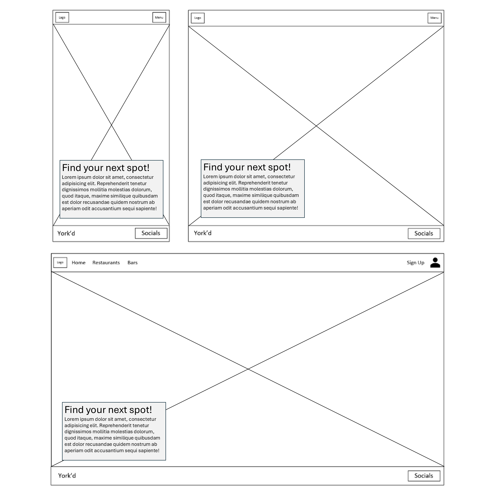

#### Restaurants

#### Specific Restaunts

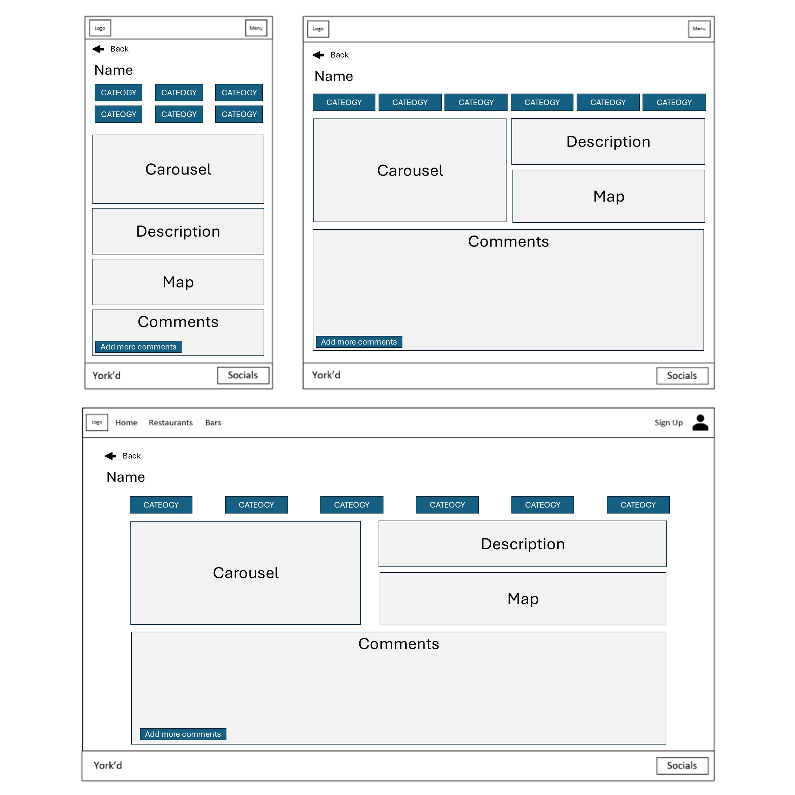

#### Bars

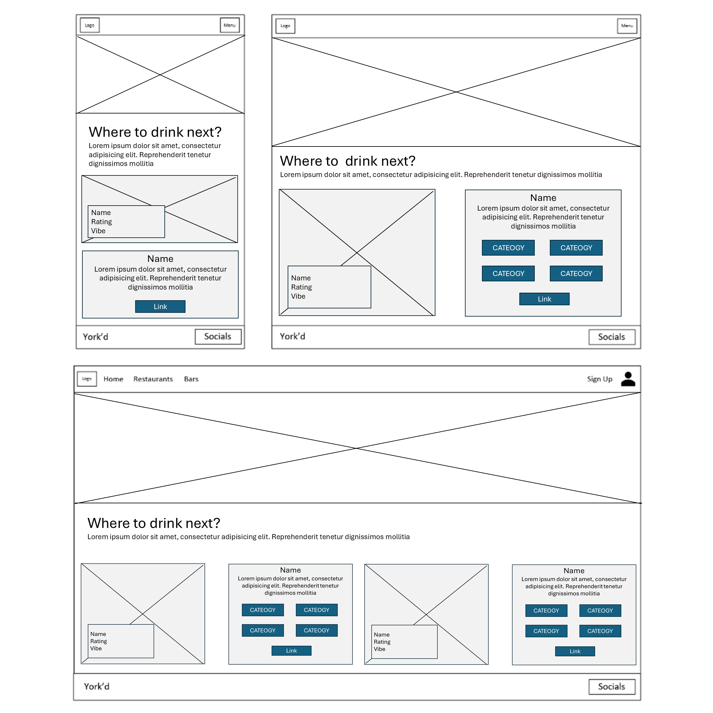

#### Specific Bars

#### Sign Up

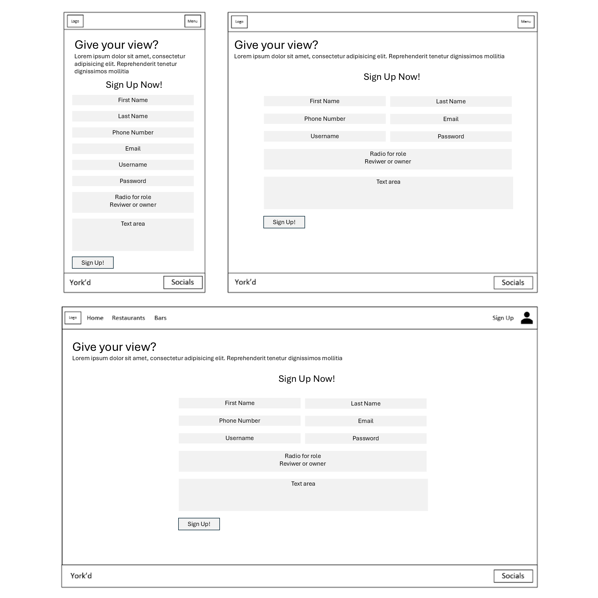

## Frameworks & Languages
This section highlights all the languages and frameworks used in this section. 

The following languages are used in this project: 

* HTML
* CSS

The following frameworks are used in this project: 

* Bootstrap v5.2.8
* Github
* Google Fonts
* Font Awesome 

## Features
This section outlines the key features on each page.

### Common Features
Common features across all sites include the navigation bar and the footer. These common features meet the needs of all users of the site. 

#### Navigation Bar
* Featured on all pages, with consistent styling and positioning for ease of use. 
* Responsive design depending on screen size (for phones and small tablets this condenses to the hambuger and a drop down)
* The current page is shown by an underline of the page name for the main 4 pages

#### Footer
* Featured on all pages, with consistent styling and positioning for ease of use.
* Contains the name of the site and link to popular social media channels 
* Responsive design for all screen sizes

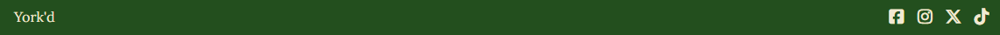

### Home 
The home page shows a clean view of a restaurant and text to set the tone of the rest of the site. Key features:

* Eye-catching photo of a restaurant 
* Heading to draw in a user
* A summary to ensure people understand the purpose of the site

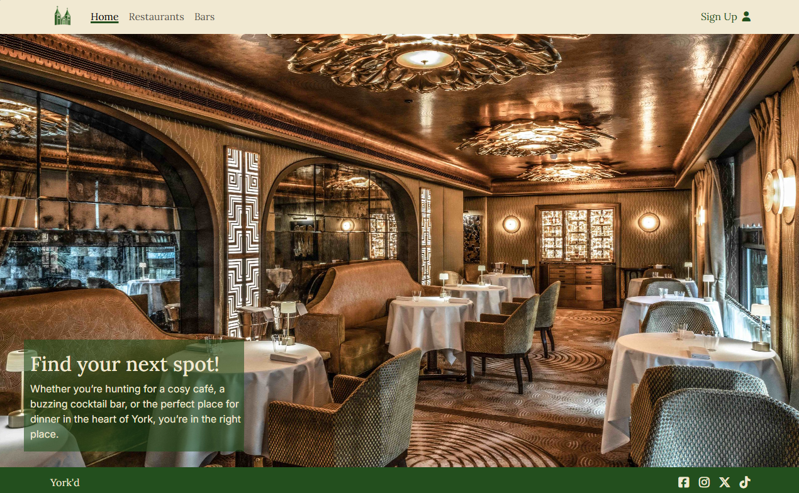

### Restaurants
The restaurant page shows users four different restaurants to choose from with key information such as name, rating and vibe displayed, along with an interactive way to display more information. 

* A header to catch the attention of users, along with a description
* A card for each restaurant, with a clear name, rating and vibe 
* Upon hovering on a card (or clicking if in dev tools or on a touch screen device), the card will rotate to display further information
* A link to a drill through for the restaurant for users that want more information

This page satisfies User 1 of the User Stories. 

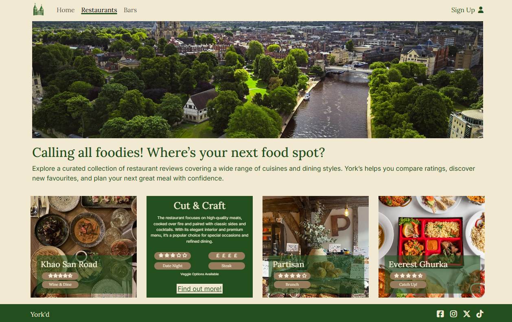

#### Restaurant Specific Pages
The restaurant specific page shows users more information for the restaurant they selected from the previous page. This has a lot of detail including futher ratings, location, pitcures and reviews. 

* A link to the previous restaurants page so users can return to the full restaurant list 
* 6 categories that are consistent across all website pages
* A carousel of images from the restaurant 
* A description of the restaurant
* A map so users can find the restaurant 
* A set of reviews that have been submitted from users 
* A model which allows a user to submit a review

This satisfies User 1 and User 3 in the User Stories.

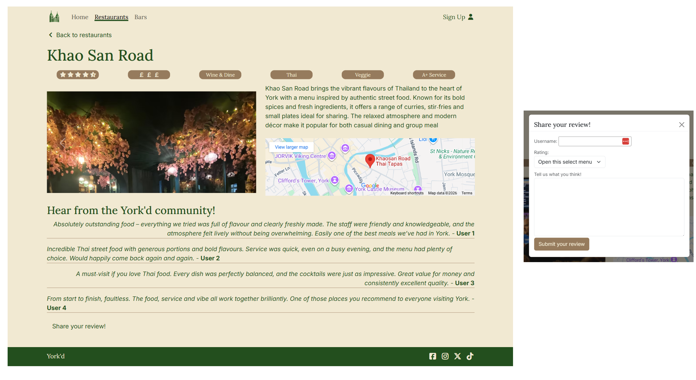

### Bars 
The bars page shows users two different bars to choose from with key information such as name, rating and vibe displayed, along with an interactive way to display more information. 

* A header and description to draw in users 
* A card for each bar, with a clear name, rating and vibe 
* Upon hovering on a card (or clicking if in dev tools or on a touch screen device), the card will rotate to display further information
* A link to a drill through for the restaurant for users that want more information

This page satisfies User 2 and 3 of the User Stories. 

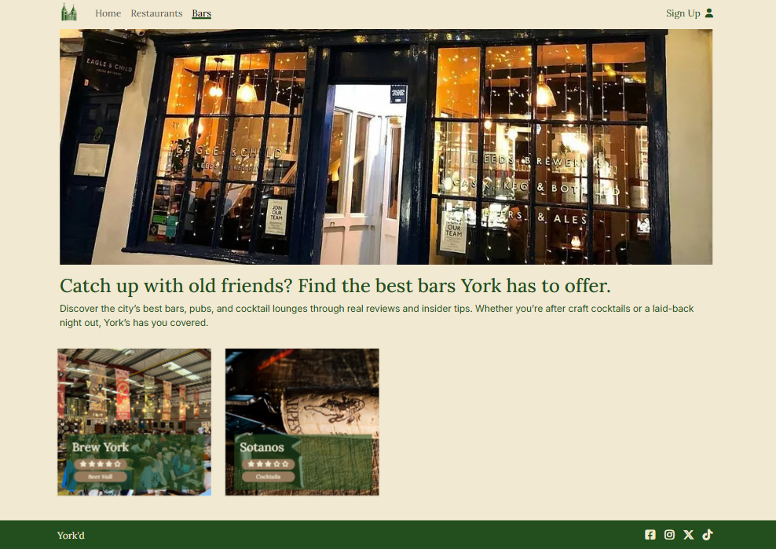

#### Bar Specific Pages
The bar specific page shows users more information for the bar they selected from the previous page. This has a lot of detail including futher ratings, location, pitcures and reviews. 

* A link to the previous bars page so users can return to the full bar list 
* 6 categories that are consistent across all website pages
* A carousel of images from the bar
* A description of the bar
* A map so users can find the bar
* A set of reviews that have been submitted from users 
* A model which allows a user to submit a review

This satisfies User 2 and User 3 in the User Stories.

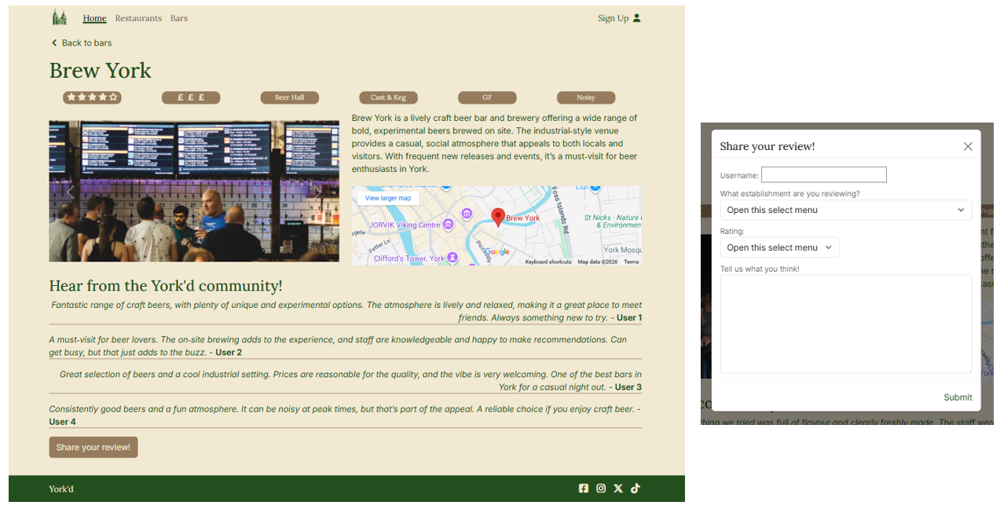

### Sign Up
The sign up page allows users to add their details to the site and make an account. At this stage only the functional HTML is working as this currently does not direct anywhere. 

* Text, number and email inputs for personal details 
* Radio buttons to outline if someone wants to review establishments or put their establishment on the site
* A text area to submit the reason you are joining 
* A sign up button to submit the details

This satisfies User 4 in the User Stories. 

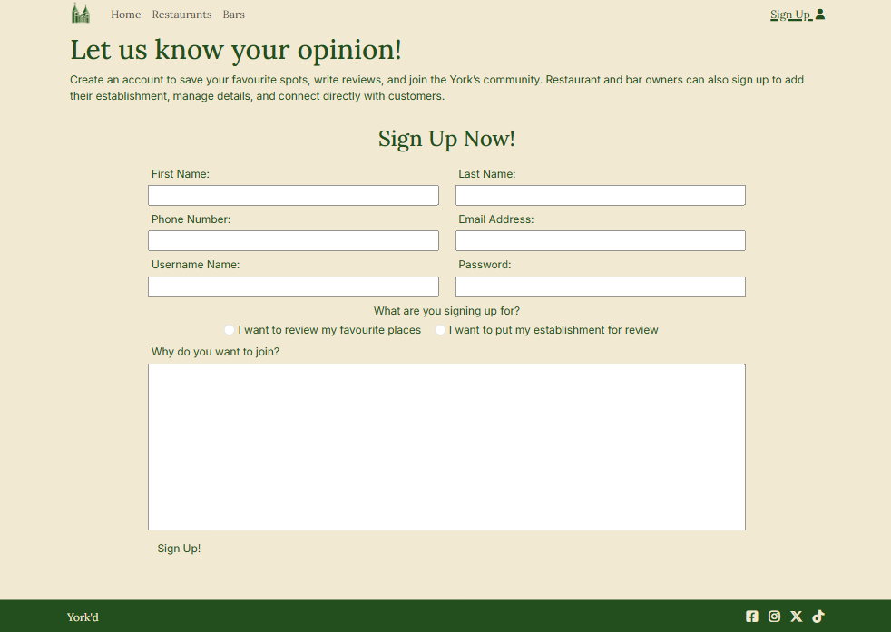

## Testing
The following testing has been undertaken as part of this project: 

### User Story Testing
Each of the following user stories outlined at the begining of this document are covered here: 

|User|User Story|Testing   |
|:-----|:-------|:-------------|
|User 1|Find a list of restaurants|By selecting the restaurant tab and  seeing the tiles displaying restaurants|
|User 1|Read review of restaurant|By selecting a restaurant tile you can view further details|
|User 1|View tags and descriptions for a restaurant|By selecting the tile you will see the tags and description for the restaurant or by hovering on the tile|
|User 2|Find a list of bars|By selecting the bars tab and  seeing the tiles displaying bars|
|User 2|View tags and descriptions for a bar|By selecting the tile you will see the tags and description for the restaurant or by hovering on the tile|
|User 2|Read reviews for a bar|By selecting a bar tile you can view further details|
|User 3|Be able to make an account for a reviewer|Select Sign Up tab and fill out details. Select the left hand radio to be a reviewer|
|User 3|Submit a review for a bar or restaurant|From the restaurant tile, select the model button at the bottom to add a restaurant|
|User 4|Be able to make an account for an owner|Select Sign Up tab and fill out details. Select the right hand radio to be an owner|
|User 4|Be able to add a restaurant or bar|When signing up write this in the text area to be reviewed by the website owner|

### Validation Tools

* validators 
* accessibility
* browser specific testing 
* dev tools testing 

## Bugs
The following bugs occured during the design of this site. 

|ID|Bug|Fix   |
|:-----|:-------|:-------------|
|#1|Flipping cards on restaurant and bar tab kept overlapping on small screens |Fixed by changing the height to an absolute px value using developer tools testing until the correct height was found|
|#2|Card content spilling over container |Resized using media queries and dev tools until correct sizing was identified and implemented|
|#3|Sotanos page not loading style |Mistyped filename not rendering as a html file but a markdown file instead|

## Deployment
This website is deployed using GitHub Pages by using the following method: 

1. Open up the github repository
2. Navigate to the Settings tab
3. Select the pages option in the 'Code and Automation' section
4. For the source choose 'deploy from branch'
5. For branch, choose main
6. After the webpage refreshes, the ribbon will say "Your site is live at  https://mturner1158.github.io/yorkd-project-1/"

## Code Used From External Sauces
The following code has been modified from sources:
* For the cards on the restaurant and bar pages, I used code from W3Schools which can be found [here](https://www.w3schools.com/howto/howto_css_flip_card.asp) to cause the responsive flipping. 
* Bootstrap provided source code for model, carousel and navbar before being modified to suit the needs of the site
* Bootstrap grid has been used for the responsive design of the site

## Credits & Disclaimer
Favicon credits: Delicious icons created by Hilmy Abiyyu A. - Flaticon

All reviews are AI generated and do not reflect actual opinions of any establishments used in this project.

